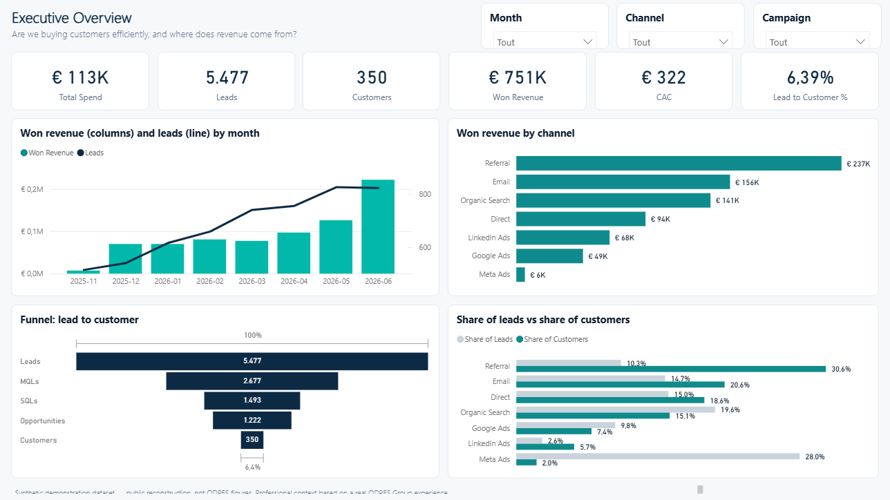
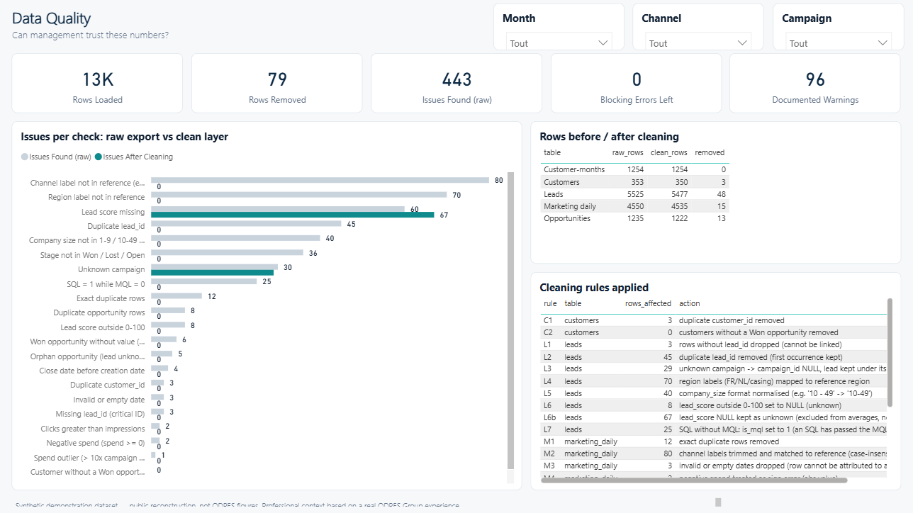
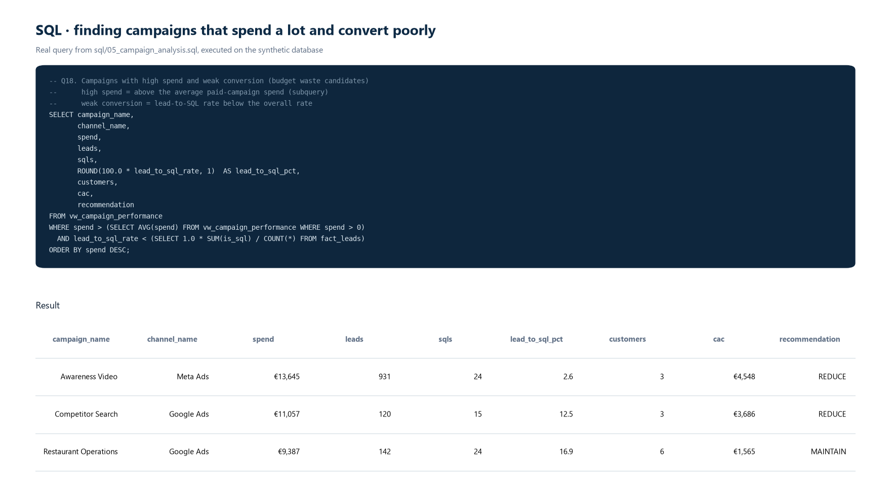
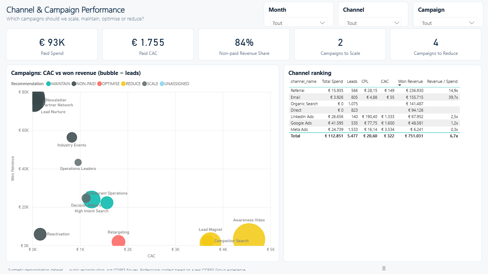
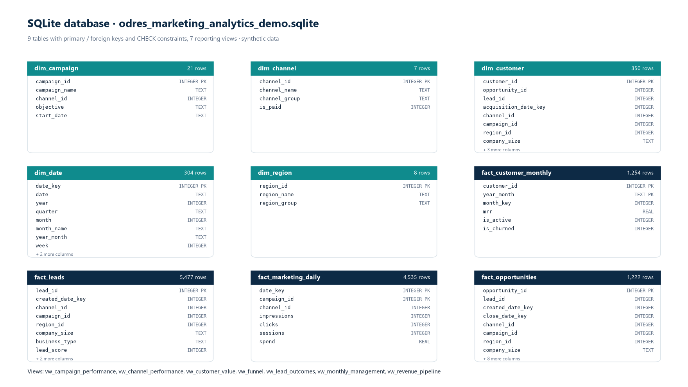
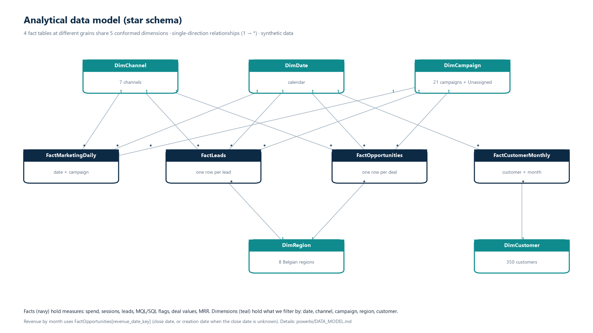
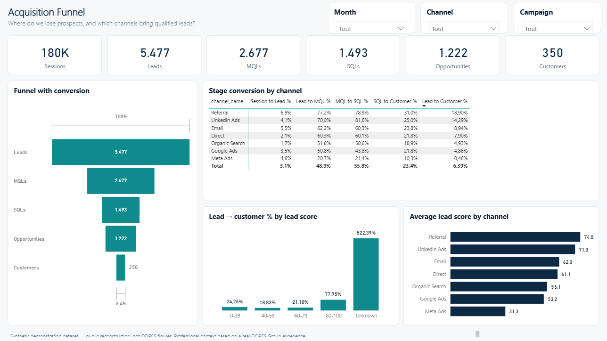
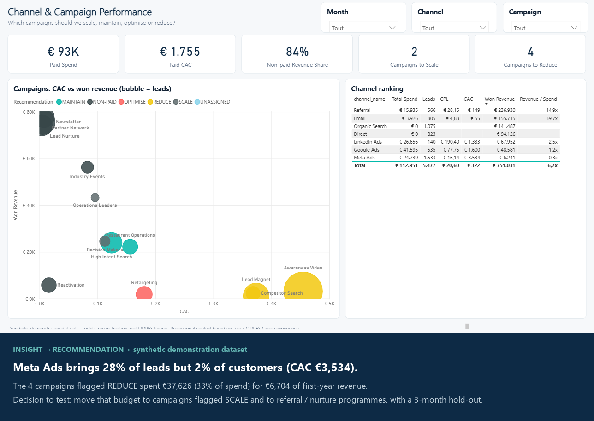

# ODRES Group
## Marketing & Commercial Performance Analytics
### Synthetic Portfolio Reconstruction

> **Professional context based on a real ODRES Group experience. Public technical reconstruction using synthetic data.**
> No ODRES client, prospect, revenue, internal data or secret is published. See [DATA_DISCLOSURE](docs/DATA_DISCLOSURE.md).



*Power BI report, Executive Overview page (screenshot from Power BI Desktop, synthetic data).*

---

## Business Problem

Marketing spend, lead quality, sales pipeline and recurring revenue sat in different tools. Channels were compared on
lead volume, not on customers and revenue.

> **How can management connect acquisition spend, lead quality, sales pipeline and recurring revenue in one reliable
> reporting model, to decide where to invest, what to fix and which channels deserve priority?**

## Context

During my ODRES Group experience (Digital Marketing & Data Assistant, Nov 2025 – Jun 2026), I worked on acquisition
performance, KPI monitoring, management reporting and business recommendations.

To make the analytical workflow publicly inspectable without exposing company information, I rebuilt a
representative reporting environment using synthetic data.

| Real experience | Public reconstruction (this repository) |
|---|---|
| Acquisition / digital performance | Synthetic dataset with realistic trade-offs |
| KPI monitoring | SQL model, views and KPI queries |
| Management reporting | Python pipeline and data-quality controls |
| Business recommendations | Power BI model, DAX, dashboard, insights |

## Dataset

Simulated business: a Belgian ERP sold by subscription (like odres.io, which lets restaurants, shops and other businesses
manage their establishment through several applications). The synthetic dataset focuses on hospitality customers
(restaurants, bars, snacks, cafés, hotels), 1 Nov 2025 – 30 Jun 2026.
Generated by [`src/generate_synthetic_data.py`](src/generate_synthetic_data.py) (fixed seed, fully reproducible).

| Table | Clean rows | Grain |
|---|---:|---|
| fact_marketing_daily | 4,535 | date × campaign (7 channels, 21 campaigns) |
| fact_leads | 5,477 | lead |
| fact_opportunities | 1,222 | opportunity |
| dim_customer | 350 | customer |
| fact_customer_monthly | 1,254 | customer × month |

Raw exports imitate real tools (ad platform, CRM, billing) and contain **20 kinds of controlled anomalies**
(duplicates, inconsistent labels, invalid dates, negative spend, outliers, SQL without MQL, orphans…).

## Architecture

```text
raw exports ─► validate ─► clean (22 rules) ─► validate ─► SQLite (keys + CHECK rules)
            ─► SQL views ─► KPI queries ─► Power BI star schema + DAX ─► dashboard ─► insights
```

Details: [ARCHITECTURE](docs/ARCHITECTURE.md) · model: [DATA_MODEL](powerbi/DATA_MODEL.md) ·
dictionary: [DATA_DICTIONARY](docs/DATA_DICTIONARY.md)

## Data Pipeline

`python run_pipeline.py` rebuilds everything in about a minute:

1. `generate_synthetic_data.py` — raw exports + reference data
2. `clean_data.py` — 22 documented cleaning rules → `data/clean/`
3. `validate_data.py` — 22 checks on raw and clean; stops if a blocking check fails → [DATA_QUALITY_REPORT](docs/DATA_QUALITY_REPORT.md)
4. `load_to_sqlite.py` — schema with keys and business rules, views, full SQL dump
5. `build_reporting_tables.py` — view exports, KPI summary, samples
6. `export_powerbi_data.py` — star-schema CSVs for Power BI
7. `build_powerbi_project.py` — TMDL semantic model, DAX documentation
8. `make_visuals.py` + `build_powerbi_proofs.py` — 6 proofs (database, SQL, model, and three built from the Power BI screenshots)
9. `run_sql_tests.py` — executes every SQL statement + 14 integrity tests

Data quality: **443 issues** found in the raw exports, **0 blocking issues** after cleaning.



## SQL

| File | Content |
|---|---|
| [01_schema.sql](sql/01_schema.sql) | 9 tables, primary / foreign keys, business rules as `CHECK` constraints |
| [02_views.sql](sql/02_views.sql) | `vw_channel_performance`, `vw_campaign_performance`, `vw_monthly_management`, `vw_funnel`, `vw_revenue_pipeline`, `vw_customer_value` (+ `vw_lead_outcomes`) |
| [03_data_quality.sql](sql/03_data_quality.sql) | row counts, business rules, referential integrity, uniqueness, warnings |
| [04_kpi_queries.sql](sql/04_kpi_queries.sql) | executive KPIs, CPL, CAC vs deal value, paid vs non-paid, lead score, MoM growth, MRR, churn |
| [05_campaign_analysis.sql](sql/05_campaign_analysis.sql) | funnel and revenue by campaign, ranks, budget waste, SCALE / REDUCE |
| [06_funnel_analysis.sql](sql/06_funnel_analysis.sql) | stage conversions, drop-off, quality vs volume, lead-score bands |
| [07_revenue_analysis.sql](sql/07_revenue_analysis.sql) | revenue share (Pareto), deal value, win rate, sales cycle, region, company size, pipeline |
| [integrity_tests.sql](tests/integrity_tests.sql) | 14 automated tests |

Techniques: joins and `LEFT JOIN … IS NULL`, `CASE WHEN`, `GROUP BY` / `HAVING`, CTEs, subqueries, window functions
(`LAG`, `RANK`, `DENSE_RANK`, running and rolling sums), `NULLIF`, `COALESCE`.



## Power BI

- Star schema: 5 dimensions, 4 facts, 3 data-quality tables, 16 single-direction relationships
- 47 DAX measures — [DAX_MEASURES](powerbi/DAX_MEASURES.md) (CTR, CPC, CPL, CAC, stage conversions, win rate,
  sales cycle, MRR, churn, MoM %…)
- Power BI Project (PBIP) with the TMDL semantic model: `powerbi/ODRES_Marketing_Analytics/`
- 6-page report specification: [DASHBOARD_SPEC](powerbi/DASHBOARD_SPEC.md)

**Status:** the PBIP opens in Power BI Desktop and **every measure matches SQL: 102/102 comparisons**
([reconciliation](docs/POWERBI_SQL_RECONCILIATION.md), `src/reconcile_powerbi_sql.py`, read-only via Microsoft's
Power BI Modeling MCP server). The 6-page report is generated in the PBIP (`src/powerbi_report.py`) and the screenshots in
`dashboard/` come from Power BI Desktop. The PBIP is the versioned source; *File → Save as* produces a `.pbix`.

## Dashboard

Six Power BI pages: Executive Overview · Acquisition Funnel · Channel & Campaign Performance ·
Pipeline & Revenue · Customer Value · Data Quality — in [`dashboard/`](dashboard/).



## Key Insights

*In the synthetic demonstration dataset* — full reasoning in [INSIGHTS](docs/INSIGHTS.md):

1. **Volume is misleading.** Meta Ads: 28% of leads, 2% of customers, CAC €3,534.
2. **€38k of spend to reallocate.** 4 campaigns flagged REDUCE spent 33% of the budget for €6.7k of revenue.
3. **A higher CAC can be the better investment.** LinkedIn: highest CPL, but the largest deals (€3,398) and a 40% win rate.
4. **Non-paid channels carry growth.** 18% of spend, 84% of first-year revenue.
5. **The lead score works.** 20.9% conversion above 80 vs 0.8% below 40.
6. **Company size drives deal value, not region.** 50+ staff: 10% of leads, 43% of revenue.

## Skills Demonstrated

SQL · data modelling · Python / pandas · data cleaning and validation · SQLite · Power BI · DAX · KPI design ·
funnel and acquisition analysis · CAC / CPL · pipeline and revenue analysis · MRR / churn · data storytelling ·
business recommendations. Recruiter shortcut: [RECRUITER_GUIDE](docs/RECRUITER_GUIDE.md).

## Repository Structure

```text
data/raw/           synthetic tool exports (with controlled anomalies)
data/reference/     channels, campaigns, regions
data/clean/         conformed tables loaded into SQLite
data/processed/     view exports, KPI summary, cleaning and QA logs
data/samples/       first 200 rows of each raw export
database/           odres_marketing_analytics_demo.sqlite
sql/                01–07 SQL files + full dump
src/                pipeline scripts (Python)
powerbi/            CSVs, PBIP (TMDL), DAX, model, dashboard spec, theme
dashboard/          6 Power BI report screenshots
proofs/             6 portfolio proofs
docs/               audit, architecture, dictionary, disclosure, business case, insights, QA
tests/              integrity_tests.sql
```

## How to Run

```bash
pip install -r requirements.txt
python run_pipeline.py
```

Open `database/odres_marketing_analytics_demo.sqlite` with DB Browser for SQLite (or any SQL client) and run
the files in `sql/`.

## Confidentiality / Synthetic Data Disclosure

Professional context based on a real ODRES Group experience. Public technical reconstruction using synthetic data.
Every row is generated; no ODRES data, client, prospect, price, revenue or secret is included.
[Full disclosure](docs/DATA_DISCLOSURE.md).

## Screenshots

| | |
|---|---|
|  |  |
|  |  |
